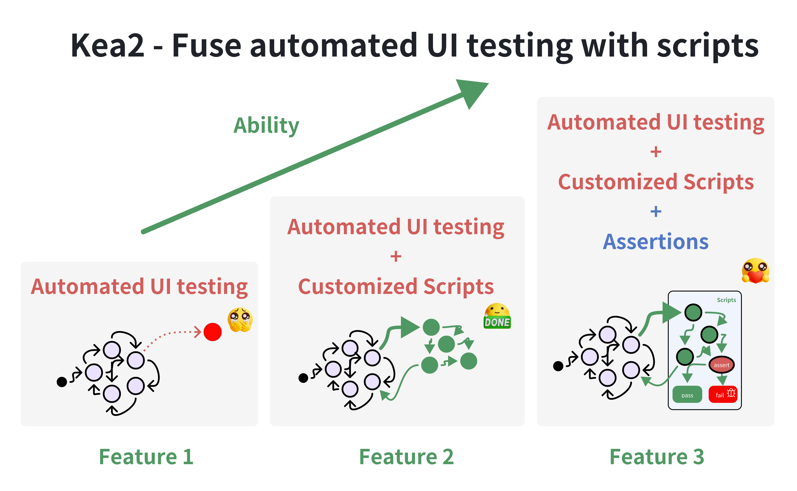
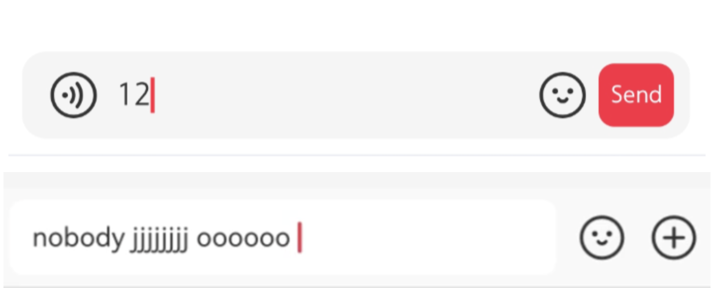

[](https://pypi.python.org/pypi/kea2-python)
[](https://pepy.tech/projects/kea2-python)


<div>
     
</div>

[中文文档](README_cn.md)

## 关于

Kea2 是一个易于使用的 Python 库，用于支持、自定义和改进移动应用的自动化 UI 测试。Kea2 的新颖之处在于能够融合人工编写的脚本与自动化 UI 测试工具，从而实现许多有趣且强大的功能。

Kea2 目前构建于 [Fastbot](https://github.com/bytedance/Fastbot_Android) 和 [uiautomator2](https://github.com/openatx/uiautomator2) 之上，主要面向[Android](https://en.wikipedia.org/wiki/Android_(operating_system)) 应用。

## 重要功能
- **功能1**(查找稳定性问题)：具备完整的 [Fastbot](https://github.com/bytedance/Fastbot_Android) 压力测试能力，能发现*稳定性问题*（即*崩溃错误*）；

- **功能2**(自定义测试场景\事件序列\黑白名单\黑白控件[^1])：运行 Fastbot 时自定义测试场景（如测试特定应用功能、执行特定事件轨迹、进入特定 UI 页面、达到特定应用状态、屏蔽特定 Activity/UI 控件/UI 区域），利用 *python* 语言和 [uiautomator2](https://github.com/openatx/uiautomator2) 提供的能力与灵活性；

- **功能3**(支持断言机制[^2])：基于继承自 [Kea](https://github.com/ecnusse/Kea) 的[基于性质的测试](https://en.wikipedia.org/wiki/Software_testing#Property_testing)理念，支持 Fastbot 运行时自动断言，用于发现*逻辑错误*（即*非崩溃错误*）。

**Kea2 中三大功能的能力对比**
|  | **功能1** | **功能2** | **功能3** |
| --- | --- | --- | ---- |
| **发现崩溃** | :+1: | :+1: | :+1: |
| **在深层状态发现崩溃** |  | :+1: | :+1: |
| **发现非崩溃功能（逻辑）错误** |  |  | :+1: |


<div align="center">
    <div style="max-width:80%; max-height:80%">
     
    </div>
</div>


## 设计与规划
作为一个 Python 库发布，Kea2 当前与以下组件配合使用：
- [unittest](https://docs.python.org/3/library/unittest.html) 作为测试框架；
- [uiautomator2](https://github.com/openatx/uiautomator2) 作为 UI 测试驱动；
- [Fastbot](https://github.com/bytedance/Fastbot_Android) 作为后台的自动化 UI 测试工具。

未来，Kea2 将扩展支持
- [pytest](https://docs.pytest.org/en/stable/)
- [Appium](https://github.com/appium/appium)、[Hypium](https://developer.huawei.com/consumer/cn/doc/harmonyos-guides/hypium-python-guidelines)（针对 HarmonyOS/Open Harmony）
- 以及其他自动化 UI 测试工具（不限于 Fastbot）


## 安装

运行环境：
- 支持 Windows、MacOS 和 Linux
- python 3.8+，Android 5.0+（需安装 Android SDK）
- **关闭 VPN** （功能2和3需要）

通过 `pip` 安装 Kea2：
```bash
python3 -m pip install kea2-python
```

运行以下命令查看 Kea2 的选项：
```bash
kea2 -h
```

## 快速测试

Kea2 连接并运行于 Android 设备。建议您先做快速测试以确保 Kea2 与设备兼容。

1. 连接真机或 Android 模拟器（一个设备足够），确保运行 `adb devices` 可以看到设备。

2. 运行 `quicktest.py` 测试一个示例应用 `omninotes`（以 `omninotes.apk` 形式发布在 Kea2 仓库中）。脚本 `quicktest.py` 会自动安装并短时测试该示例应用。

在你偏好的工作目录下初始化 Kea2：
```python
kea2 init
```

> 如果是首次运行 Kea2，此步骤必需。

运行快速测试：
```python
python3 quicktest.py
```

如果您看到应用 `omninotes` 成功运行并接受测试，说明 Kea2 工作正常！  
否则，请帮助我们[提交 Bug 报告](https://github.com/ecnusse/Kea2/issues)，附上错误信息。感谢！

## 功能1(运行基础版Fastbot：查找稳定性错误)

使用完整的 Fastbot 能力进行压力测试，查找*稳定性问题*（即*崩溃错误*）；

```bash
kea2 run -s "emulator-5554" -p it.feio.android.omninotes.alpha --agent native --running-minutes 10 --throttle 200
```

理解以上参数请查看[文档](docs/manual_en.md#launching-kea2)

> 该用法类似于原始 Fastbot 的[shell 命令](https://github.com/bytedance/Fastbot_Android?tab=readme-ov-file#run-fastbot-with-shell-command)。

查看更多选项：
```bash
kea2 run -h
```

## 功能2(运行增强版Fastbot：自定义测试场景\事件序列\黑白控件)

在使用 Fastbot 等自动化 UI 测试工具测试应用时，你可能会发现某些特定的 UI 页面或功能难以到达或覆盖，原因是 Fastbot 对应用缺乏了解。幸运的是，这正是脚本测试的优势。功能2中，Kea2 支持编写小脚本指导 Fastbot 探索任意区域。你也可以使用这些小脚本在 UI 测试中屏蔽特定控件。

在 Kea2 中，一个脚本包含两个要素：
- **前置条件**：何时执行该脚本。
- **交互场景**：测试方法中指定的交互逻辑，用以达到目标位置。

### 简单示例

假设 `Privacy` 是自动 UI 测试时难以到达的页面，Kea2 可以轻松指导 Fastbot 访问该页面。

```python
    @prob(0.5)
    # precondition: 当我们处于页面 `Home`
    @precondition(lambda self: 
        self.d(text="Home").exists
    )
    def test_goToPrivacy(self):
        """
        指导 Fastbot 到页面 `Privacy`，方法是打开 `Drawer`，
        点击选项 `Setting` 再点击 `Privacy`。
        """
        self.d(description="Drawer").click()
        self.d(text="Settings").click()
        self.d(text="Privacy").click()
```

- 通过装饰器 `@precondition` 指定前置条件 — 当我们位于 `Home` 页面。  
  `Home` 页面是 `Privacy` 页入口，且 Fastbot 容易达到 `Home` 页面，故脚本会在检查到唯一控件 `Home` 存在时触发。  
- 脚本的测试方法 `test_goToPrivacy` 定义了交互逻辑（打开 `Drawer`，点击 `Setting`，点击 `Privacy`）以引导 Fastbot 到 `Privacy` 页面。  
- 装饰器 `@prob` 指定在 `Home` 页面时以 50% 的概率执行该指导逻辑。这样，Kea2 同时允许 Fastbot 探索其他页面。

完整示例可见脚本 `quicktest.py`，使用 Fastbot 运行该脚本命令为：

```bash
# 启动 Kea2 并加载单脚本 quicktest.py
kea2 run -s "emulator-5554" -p it.feio.android.omninotes.alpha --agent u2 --running-minutes 10 --throttle 200 --driver-name d unittest discover -p quicktest.py
```

## 功能3(运行增强版Fastbot：加入自动断言)

Kea2 支持在 Fastbot 运行时自动断言，用于发现*逻辑错误*（即*非崩溃错误*）。为此，你可以在脚本中加入断言。断言失败时，说明发现了可能的功能缺陷。

功能3中的脚本包含三个要素：

- **前置条件**：何时执行脚本。
- **交互场景**：测试方法中定义的交互逻辑。
- **断言**：期望的应用行为。

### 示例

在社交媒体应用中，发送消息是常用功能。在消息发送页面，当输入框非空时，`send` 按钮应始终出现。

<div align="center" >
    <div >
        
    </div>
    <p>期望行为（上图）与错误行为（下图）。</p>
</div>

对于上述始终成立的性质，我们可以编写如下脚本验证功能正确性：当消息发送页面存在 `input_box` 控件时，输入任意非空字符串，并断言 `send_button` 应保持存在。

```python
    @precondition(
        lambda self: self.d(description="input_box").exists
    )
    def test_input_box(self):
        from hypothesis.strategies import text, ascii_letters
        random_str = text(alphabet=ascii_letters).example()
        self.d(description="input_box").set_text(random_str)
        assert self.d(description="send_button").exist

        # 我们甚至可以做更多断言，比如：
        #       输入的字符串应显示在消息发送页面上
        assert self.d(text=random_str).exist
```
> 我们使用 [hypothesis](https://github.com/HypothesisWorks/hypothesis) 库生成随机文本。

可参照功能2命令行以运行此示例。

## 文档（更多文档）

[更多文档](docs/manual_en.md)，涵盖：
- Kea2 案例教程（基于微信示例）
- Kea2 脚本定义方法，支持的脚本装饰器（如 `@precondition`、`@prob`、`@max_tries`）
- Kea2 启动方式与命令行选项
- 如何查看/理解 Kea2 运行结果（如界面截图、测试覆盖率、脚本是否成功执行）
- [如何黑白控件/区域](docs/blacklisting.md)

## Kea2 使用的开源项目

- [Fastbot](https://github.com/bytedance/Fastbot_Android)
- [uiautomator2](https://github.com/openatx/uiautomator2)
- [hypothesis](https://github.com/HypothesisWorks/hypothesis)

## Kea2 相关论文

> General and Practical Property-based Testing for Android Apps. ASE 2024. [pdf](https://dl.acm.org/doi/10.1145/3691620.3694986)

> An Empirical Study of Functional Bugs in Android Apps. ISSTA 2023. [pdf](https://dl.acm.org/doi/10.1145/3597926.3598138)

> Fastbot2: Reusable Automated Model-based GUI Testing for Android Enhanced by Reinforcement Learning. ASE 2022. [pdf](https://dl.acm.org/doi/10.1145/3551349.3559505)

> Guided, Stochastic Model-Based GUI Testing of Android Apps. ESEC/FSE 2017.  [pdf](https://dl.acm.org/doi/10.1145/3106237.3106298)

### 维护者/贡献者

Kea2 由 [ecnusse](https://github.com/ecnusse) 团队积极开发和维护：

- [Xixian Liang](https://xixianliang.github.io/resume/) ([@XixianLiang][])
- Bo Ma ([@majuzi123][])
- Chen Peng ([@Drifterpc][])
- [Ting Su](https://tingsu.github.io/) ([@tingsu][])

[@XixianLiang]: https://github.com/XixianLiang
[@majuzi123]: https://github.com/majuzi123
[@Drifterpc]: https://github.com/Drifterpc
[@tingsu]: https://github.com/tingsu

[Zhendong Su](https://people.inf.ethz.ch/suz/)、[Yiheng Xiong](https://xyiheng.github.io/)、[Xiangchen Shen](https://xiangchenshen.github.io/)、[Mengqian Xu](https://mengqianx.github.io/)、[Haiying Sun](https://faculty.ecnu.edu.cn/_s43/shy/main.psp)、[Jingling Sun](https://jinglingsun.github.io/)、[Jue Wang](https://cv.juewang.info/) 也积极参与并做出大量贡献！

此外，Kea2 得到了来自字节跳动（[Zhao Zhang](https://github.com/zhangzhao4444)、Fastbot 团队的 Yuhui Su）、OPay（Tiesong Liu）、微信（Haochuan Lu、Yuetang Deng）、华为、小米等工业界人员的许多宝贵建议、反馈和启示。感谢所有支持者！

[^1]: 许多 UI 自动化测试工具提供“自定义事件序列”能力（如[Fastbot](https://github.com/bytedance/Fastbot_Android/blob/main/handbook-cn.md#%E8%87%AA%E5%AE%9A%E4%B9%89%E4%BA%8B%E4%BB%B6%E5%BA%8F%E5%88%97) 和[AppCrawler](https://github.com/seveniruby/AppCrawler)），但实际使用中存在能力有限、灵活性差等问题。不少 Fastbot 用户曾抱怨“自定义事件序列”使用体验问题，如[#209](https://github.com/bytedance/Fastbot_Android/issues/209), [#225](https://github.com/bytedance/Fastbot_Android/issues/225), [#286](https://github.com/bytedance/Fastbot_Android/issues/286)等。

[^2]: 在 UI 自动化测试过程中支持自动断言是一项重要能力，但几乎没有测试工具提供。注意到[AppCrawler](https://ceshiren.com/t/topic/15801/5)开发者曾计划提供断言机制，用户反响热烈，并从2021年开始催促更新，但至今未实现。